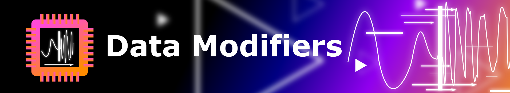

Data Modifiers can be used to modify data... .. . 
They take a data set, along with some other modifier specific parameters and output a dataset with the modification applied.
This way, they can be cascaded to a modifier pipeline. 
Note, that the modifiers don't change the hyper parameters stored in the data blocks and thus are not documented in the report that is automatically generated by the benchmark. You have to come up with another way of keeping track of the modifiers, e. g. by folder name. Implementing this functionality is something for the future. 
Modifiers are designed to quickly augment data. 
In the following sections we describe the present modifiers. Utility.py is just a module that houses often used sub functions for the modifiers.

## addNoise.py

This modifier takes a data set and adds uniform distributed noise with a level that is specified by the user to it.

## smooth.py

This modifier applies a rolling average of a user specified window size to a dataset.

## resample.py
Takes the input dataset and converts to a diffrent number of points in time. The Dataset consists of points in time with values assigned to them. There are either explicit time stamps for the points or not. If not, it is assumed, that the time series is sampled eqidistant.
Resample takes the input and converts it to a set of time series, that are sampled equidistant to another grid of time stamps. This is done by interpolation of the time series. At the moment, the only supported way to interpolate is linear interpolation.
This is basically a wrapper for Torch.NN.Functional.Interpolate.
Not equidistant points with explicit time stamps are not supported at the moment!

