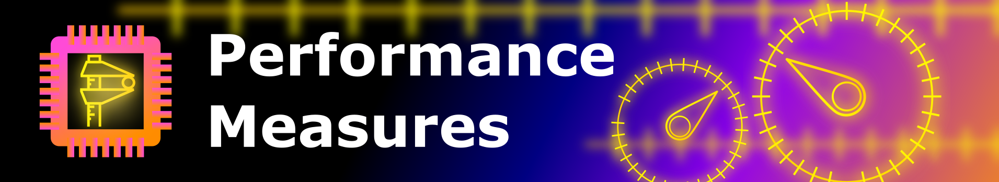

There are two diffrent performance measures in this framework, each having separate interfaces. The ReconstructionErrors.py measuring the quality of the reconstruction and the AUSScore.py, determining the AUC-score under the ROC-Curve. 
Both are automatically evaluated in the Benchmark.py.

## Reconstruction Errors

The reconstruction Error is a simple wrapper for the loss functions that are specified in pytorch. Its main function is the calculate function, that takes the model and a data point and returns the reconstruction error of the model on that data point. 
We refer to the sourcecode for more information.

## AUC-Score

For a detailed explanation of the AUC-score, we refer to the detection theory chapter of Kush Varshney's Trustworthy Machine Learning: http://www.trustworthymachinelearning.com/trustworthymachinelearning-06.htm  
In our Framework, AUC-Score is evaluated as follows:

* The method for the AUC-Evaluation takes a model and a data set. The model is than used to evaluate this data set.
* For each snippet of time series in that data set, the absolute value of the difference of each point in that snippet in the reconstruction and
in the original is caluclated.
* The maximum of these absolute differences is saved as well.
* The ROC-Curve is created, by evaluating the classification of a binary classifier that calls a data point in a snipped anomalous if the reconstruction error exceedes a certain treshhold.
* This Threshhold is altered from 0 to the maximum value in a number of equidistant steps defined by the user, to monitor the ROC-curve.
* The AUC is than calculated using a quadrature (numeric integration).
* The AUC is approximated with the trapezoid rule, the error of the AUC is the difference between the left-hand- and the right-hand- square rule, which for a monotone function, is an exact measure for the possible worst case sampling error.

### Some comments on that:
* There are two types of labeled anomalies: The once, where actual anomalies are labeled in the data, and the once, where the whole time series snippet is marked anomalous. This is a result of the different data set wrappers used. In some occasions, like for the SMD, the data it self comes with labeled anomalies. In this case, the labels are simply loaded. 
In the case of e.g. UCR or ECG, where classes are labeled anomalous, not points in the series, the complete snippet, where an anomalous class is depicted is marked anomalous.  
The way, the algorithm is evaluated is different in these two situations, since, in the latter one, we don't know, which points make a given class anomalous. In the first case, we know exact points in time.  
For the first kind of data, TPR, FPR and so on are evaluated for each point in time. 
For the second kind, the predictions of the classifier are split in intervals. Meaning: All the neihgbouring points that have the same label where evaluated at once. THan, the rates for the whole interval where decided by the majority of the predictions in that interval.
* There are occasions, where the uncertainty in AUC-score is high, due to bad sampling. We know that and plan on developing a adaptive sampling AUC-quadrature.
* The method, in its currend state is darn slow. Infact, it significantly contributes to the overall runtime of the benchmark. We plan on improoving this.
