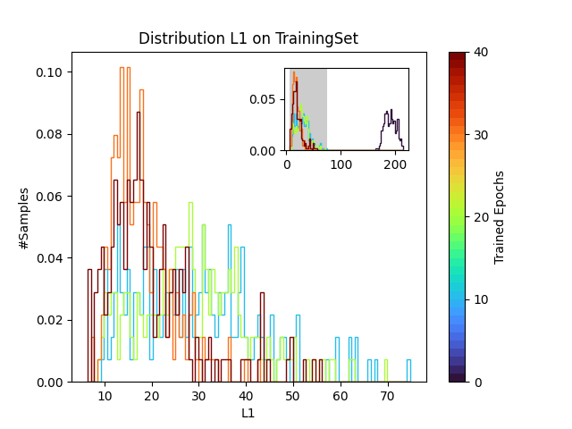

This repository features a variety of premade evaluation functions. At the moment, most of them are plot scripts, that take the data that was created during a single benchmark run and visualize it. 
The greate exception is the HTMLSummary.py, which creates a ml-ops like html overview that unifies the plot scirpts.  
In addition to the plots like the evaluation of the average error with training and the histograms of the error, the benchmark scipt also selects examples where the model performed good, bad or average on.

## The HTML-Overview:

This HTML Overview is created in the HTMLSummary.py scirpt using a blank HTML-template file (HTMLRescources/OverviewTemplate.html) that is than filled with the script. To create this summary, all the plots listed below have to be calculated. The QuickOverview.py Script can be used to create all the plots and afterwards the HTML Overview.

<pre><code>
from TimeSeriesAEBenchmarkSuite.Evaluation.QuickOverview import plotOverview

plotOverview(DirOfTheBenchmarkResults)
</code></pre>

## Plot Functionality:

In the following sections we briefly cover the functions of this portion of the framework. 
Here are the plots that can be created with the onboard functionality of the library:

### Errors VS Epochs:

This Plot shows how the reconstruction error on the different sets changes with the epochs. It can be created with the plotErrors function in the Utility_Plot/ErrorPlotter.py scirpt.

<pre><code>
import matplotlib.pyplot as plt
from TimeSeriesAEBenchmarkSuite.Evaluation.Utility_Plot.ErrorPlotter import plotErrors

fig,ax = plt.subplots()
plotErrors(DirOfTheBenchmarkResults,ax,"L1")
plt.show()
</code></pre>

### Histograms at the Milestones:

This plot shows how the reconstruction error on the set evolves with the milestone epochs. Milestone epochs are epochs that are specified by the user. On milestone epochs, informations and modelweights get logged. The plot can be created using the Utility_Plot/MilestoneHistograms.py script:

<pre><code>
import matplotlib.pyplot as plt
from Evaluation.Utility_Plot.MilestoneHistograms import plotMilestoneHistograms

fig,ax = plt.subplots()
plotMilestoneHistograms(DirOfTheBenchmarkResults,ax,"L1","TrainingSet")
plt.show()
</code></pre>

### A Single Example:

During the benchmark tests with large, small and average reconstruction error are logged. These logged examples can be displayed using the Utility_Plot/ExamplePlotter.py script:

<pre><code>
import matplotlib.pyplot as plt
from TimeSeriesAEBenchmarkSuite.Evaluation.Utility_Plot.ExamplePlotter import plotExample

fig,ax = plt.subplots()
plotExample(DirOfTheBenchmarkResults,ax,NameOfExample)
plt.show()
</code></pre>

If errors are labeled in the examples, they are marked grey.

### Reconstruction Error: Set Average VS Example:

For a logged example, it is also possible to plot the reconstruction error for one individual example compared with the average reconstruction error on the whole set. This can be done using the Utility_Plot/ErrorPlotter.py script:

<pre><code>
import matplotlib.pyplot as plt
from TimeSeriesAEBenchmarkSuite.Evaluation.Utility_Plot.ErrorPlotter import plotErrorsAgainstExample

fig,ax = plt.subplots()
plotErrorsAgainstExample(DirOfTheBenchmarkResults,ax,'L1',NameOfExample,"Training",exampleIndex=26)
plt.show()
</code></pre>

### Reconstruction Error: The Example in the Histogram:

The reconstruction error of a logged example can be plotted into a histogram showing the reconstruction error the trained model makes on the whole set. This can be done using the Utility_Plot/HistogramAndExample.py script:

<pre><code>
import matplotlib.pyplot as plt
from TimeSeriesAEBenchmarkSuite.Evaluation.Utility_Plot.HistogramAndExample import plotExampleLocation

fig,ax = plt.subplots()
plotErrorsAgainstExample(DirOfTheBenchmarkResults,ax,'L1',"Training",exampleIndex=26)
plt.show()
</code></pre>

### Model Reconstructions of One Example:

The data for a logged example and the reconstruction the model creates after different numbers of epochs of training can be displayed using the Utility_Plot/MilestonePlotter.py Scipt. If there are to many dimensions in the example, so that displaying all of them at once would results in an unreadable plot, example dimensions are selected. Dimensions where selected, where the algorithm performed good, bad and average on. This number of dimensions can be specified by the user.

<pre><code>
import matplotlib.pyplot as plt
from TimeSeriesAEBenchmarkSuite.Evaluation.Utility_Plot.MilestonePlotter import plotMilstones

fig,ax = plt.subplots()
plotMilestones(DirOfTheBenchmarkResults,ax,NameOfExample)
plt.show()
</code></pre>

