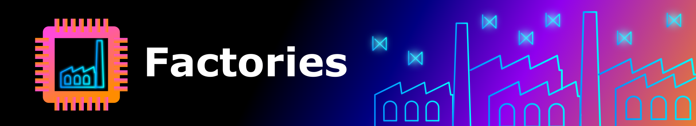

The main purpose of the factories is to give the user the ability to iterate trough a standard, often used set of object (mainly models and datasets) without writing many lines of code. 
Say You have developed a new model and just want to find out how it behaves on different data compared to some baseline. Factories provide the capability to quickly sketch a script that does that without the need for extensive code. Also, by using the examples form the script, creating comparable results is much easyer, since the objects from the factories are a kind of standard.

## DataSource

DataSource is a factory that provides access to 173 data sets by index:

* Index 0-3: Data from the Sines Data genrator.
* Index 4: ECG data set, only the arythmia part.
* Index 5,6: SMD (different sample methods on machine 1_1)
* Index 7-127: Data sets from the UCR-time series classification archive.
* Index 128-155: Different Machines from SMD.
* Index 156-170: Data from the Sines Data generator.
* Index 171-173: Data from the ECG.

