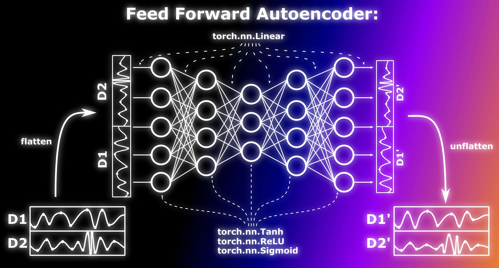
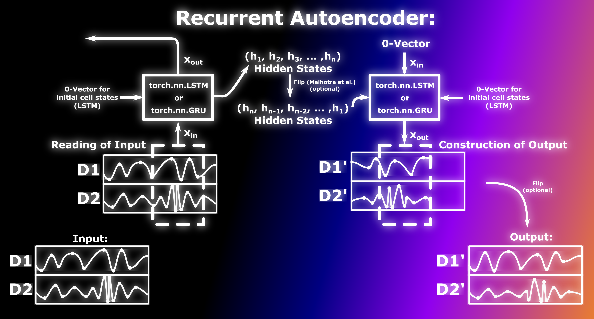
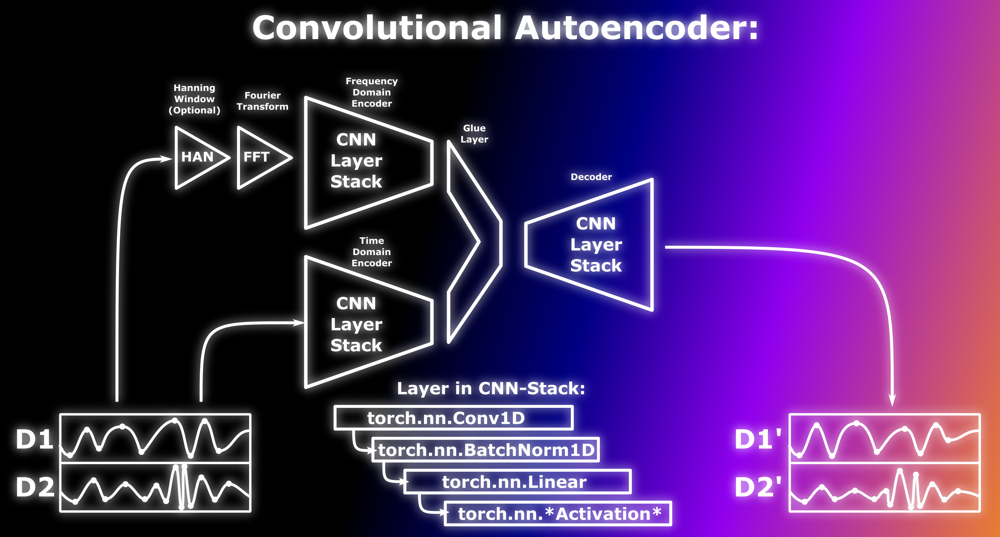
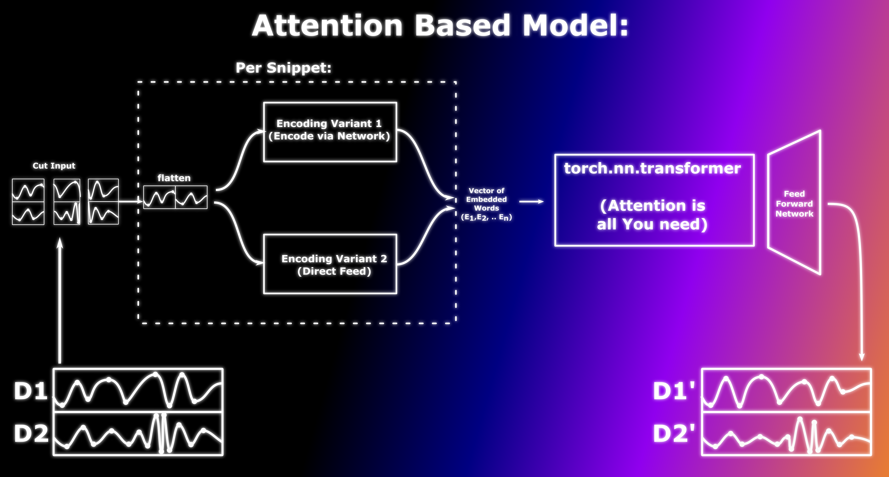

The models in this framework all implement the same interface. They are subclasses of block, to handle the hyperparamters. They all take said hyperparameters, the dimension of the input stream and the compute device as constructor input, and they all are also subclasses of torch.nn.module. 
In the forward function, that the nn.Module objects have to overwrite in order to define the calculation done in the module, they all take a time series as an input and return a time series of similar dimensionality as output. 
In the next few sections we describe the diffrent models in this package in detail.

## Feed Forward Autoencoder

The feed forward autoencoder is the most generic reconstructing model that is available in the library. It consists of layers of feed forward perceptrons with a user specified activation function. The layer size does not have to conform to the classic auto encoder scheme (starting huge, getting smaller until the latent space is reached, getting larger again.). The first and last layer have the same number of neurons, one for each datapoint in the in and output. The user has two diffrent ways to configure the inner layers of the autoencoder.
* The user can pass an array of dubles, that contains the size of the inner layers in fractions of the input. An array like [0.5, 0.1, 0.5] would result in an autoencoder with 3 inner layers, the first has 0.5 times the number of neurons as the input, the second has 0.1 times the number of neurons and so on.
* The second way requires less hyper parameters. In this setting, the user just specifies the number of layers in the encoder and decoder and the size of the latent space layer. The constructor than linearly interpolates the size of the layers in between. An input of two layers per encoder/decoder and a latent space size of 0.5 for a input that has 64 valus would result in an autoencoder with 7 layers (1 input, two encoder, 1 latent space, 2 decoder, 1 output) that have the following number if neurons: (Input 64, Encoder 1: 56, Encoder 2: 48, Latent Layer: 32, Decoder 1: 48, Decoder 2: 56, Output 64). 

There are also two ways to feed the time series in the input layer of the encoder:
* One way is to  just flatten the time series, if it is multidimensional.
* The second way is to cut the time series into snippets, than flatten these snippets and than concatenate the input. The idea here is, that the parts in the different dimensions, that describe one interval in time are closer together, when des into the encoder. This strategy is not depicted in the picture showing the model details for the feed forward AE. It is depicted in the picture for the attention based method, since this is one of the word embedding methods that are at hand for this model. 

### Model Details

### Hyperparameters

<pre><code>
return {"InputSize":150,
                "LayerSequence":[1,0.7,0.3,0.2,0.3,0.7,1],#in multiples of the input ... first and last must be 0
                "ActivationFunction":"ReLU",
                "SlicingBeforeFlatten":True,#If Slicing is true, the tensors will not be flattend, the tensors will be sliced along the time axis, these slices will than be flattend and concatenated.
                "SliceLength":0.1, #of sequence lenght
                "LayerSequenceLinear":True, #if this is true, the layer sequence above will be ignored. instead a linear progression of th layer size to the latent space will be calculated. The layer Sequence will than be overwritten by that.
                "LatentSpaceSize":0.1,
                "NumLayersPerPart":3
                } 
</code></pre>

## Recurrend Autoencoder

This model realizes an autoencoder using recurrend neural networks (either torch.nn.GRU or torch.nn.LSTM). The latent space is realized by creating two recurrend network stacks. The first stack processes the input time series sequentially. After this sequential reading is complete, the hidden states of this layer stack represent the latent space (the direct output is ignored). The hidden states get then transfered to the second stack, which gets a zero-vector as input and should rebuild the input based on the hidden states. 
Optionally, we added the posibillity to flip the latent hidden states and, if they where flipped, flip the output later. This is a strategy that was adopted from Malhotra et al. (https://arxiv.org/pdf/1607.00148.pdf). The idea here is, that by flipping, the second RNN stack constructs the time series from the last processed point on into the past, which is more natural from the flow of information, than starting with the first point in time (which was also the first one processed by the first stack, so the resemblens of it in the hidden states might be the smallest) to the last.

### Model Details

### Hyperparameters

Cell kind can have the two values "LSTM" and "GRU".

<pre><code>
{
                "HiddenStates":32,
                "Layers":4,
                "BaseDecoderReconstructionOnZeros":True,
                "PerformLatentFlip":True, #flipping the latent space like malhorta et al.
                "CellKind":"LSTM"}
</code></pre>

### Some Notes

When training the network with mostly default settings on the batched trainer (batch size = 10, learning rate in the adam optimizer = 0.001) we noticed, that the loss "jumps" when plotted against the epochs. The loss function remains stationary for many epochs, and than suddently reaches another value. This new value is in some cases higher, in some cases lower then the previous one. We do not know if this behaviour can be omitted by fine tuning the learning rate or a diffrent batching strategy. 
As a hot fix for this, it may be advantageous to include a history for the training, like for the LSTM based approach that is shown in this blog (our very first  prototype implementation of this framework was based on it and we kept the history functionality ever since... https://curiousily.com/posts/time-series-anomaly-detection-using-lstm-autoencoder-with-pytorch-in-python/).

## Convolutional Autoencoder

This model resembles an auto encoder that is based on a convolutional neural network. 
The convolutional layers consist of one torch.nn.Conv1D layer, followed by a torch.nn.BatchNorm1D layer. Afterward, there is a linear layer, where the size of the output of the first two layers is transformed (either smaller or lager depending on the size of the next convolutional layer). This sequence of four is ended with a layer of activation functions.  
Following an approach that was suggested in this blog post (https://www.kaggle.com/code/purplejester/pytorch-deep-time-series-classification), we included a second endocer that is a twin of the first one, with the exception that this encoder processes the fourier transform of the given time series, instead of the time domain representation. In our implementation, the user can decide wheter the model should use both encoders in parallel, only the time domain one or only the frequency domain one.  
As an addition, it is possible to add a hanning window before fourier transform.  
If both encoders are used, the number of valueas in the two encoder outputs is reduced, to fit the standard decoder, that takes inputs of the same size as the output of a single encoder. This reduction is done by a feed forward neural network. The size of the layers is linear interpolated, similar to the feed forward autoencoder. This network is called the glue layer. 

### Model Details

### Hyperparameters

<pre><code>
        return {
                "InputSize":150,#size of the input data...
                "KernelSize":5,#Size of kernel for the convolution
                "LayerSequenceEnc":[0.7,0.5], #Size of the layers in relation to the input
                "LatentSize":0.2, #size of the latent space in relation to the input
                "LayerSequenceDec":[0.5,0.7], #size of the layer in relation to the input
                "hasFFTEncoder":False, #if true, a second encoder, beside the time encoder is added, that porcesses the fft. 
                "HanningWindowBeforeFFT":True, #Uses the Hanning window before computing the FFT, if FFT encoder is there...
                "GlueLayerSize":2, #There is a stack of perceptrons that takes the output of the FFT- and TimeDecoder and Broadcasts them to the encoder input. That stack can have a height, specified here.
                "hasOnlyFFTEncoder":False,#if true, only a fft encoder is provided
                "ActivationFunction":"ReLU", #activation function used perceptrons across the net
               # "DownsampleByPooling":True, #if true, the downsampling in the decoder is done by pooling. if not, a layer of perceptrons does the job.
                "BatchNorm":True,#if true, a batchnorm is applied after each covolution.
            }
 
</code></pre>

### Note on the Hanning Window

The fourier transform is designed for periodic functions. If the fourier transform of a finite snippet of a function is taken, one implicitly assumes, that the snipper repeats it self over and over. This curcumstance, that is often not true in reality leads to artefacts, due to components in the fourier spectrum that relate to that assumed periodicity. This is especially a problem when the values at the boundary of the transformed snippet don't line up. THe dicontinuity araising there introduces storng, high frequent artifacts. Taking the hanning window dampens the function at the boundary in a way that no artifacts result in the fourier transform. THe traidoff here is that the hanning window takes away information from the input. The gain is, that after windowing, everything that remains in the specturm is a feature of the transformed sereis. We choose to make the hanning window optional, since in an ideal world, the network that processes the raw fft would be able to "learn" the relevant portions and perhaps be able to extract more information than there is left after windowing, while not falling for the artifacts.

### Other Notes

* The DownsampleBeforePooling functionality is not implemented at the moment.
* At the moment, the FFT encoder is lager than it needs to be. It has the same size as the time series in time domain. The values of the FFT are bounded by the nyquist sampling theorem. This number is smaller, than the number of points in the time domina. We have to address this issue at some point.

## Attention Based Autoencoder

This model uses the transformer implementation of pytorch, which is designed following the "attention is all you need" transformer (https://proceedings.neurips.cc/paper/2017/file/3f5ee243547dee91fbd053c1c4a845aa-Paper.pdf) to process time series. 
The intuition behind this model is as follows: Natural language is very hard to process. What makes it so difficult to process natural language is (beside some other things) its context sensitivity. Even in normal plain speach, a situation can arraise, where one small sentence changes the meaning of an entire text passage. This is in contrast to say e.g. image data, where the value of one pixel mostly depends on the pixel in the surrounding area. 
Transformer models are succsessful in natural language processing tasks, because the attention mechanism can handle these contextual dependencies. The idea is, that time series can also show this context sensitive dependencies and similar to language, time series also have an intrinsic dependency on time. Since there are similarities between time series and natural language, the assumption is, that the transformer is also performing well when interpreting time series. 
For simple protoryping we decided to use the pre implemented transformer from pytorch in this version of the model. The main challenge was to feed the time series into the transformer in a way that makes sence. 
When the transformer is used to process natural languages, the words are embedded into an array of vectors. Depending on the implementation, either a mathematical function or a neural network is used for this task (post processor network). The output of the transformer again is a vector that can be mapped onto a dictionary to produce output sentences. 
In our implementation, we replaced the dictionary with a neural network, that takes the output of the transformer and maps it to a tensor of the same dimensionalty as the input. . Instead of words, snippets of the time series are processed. The snippets are either fed directly into the transformer, or get transformed by a feed forward neural network (preprocessor network).

### Model Details

### Hyperparameters

<pre><code>
{"InputSize":150,
                "nWords":15,
                "WordSize":20,
                "nPreprocessorLayers":2,
                "ActivationFunctionPreprocessor":"Tanh",
                "FeedDirect":True,#if false, a linear feed forward network will be used instead of the embedding
                "nAttentionHeads":4,
                "nTrEncoderLayers":2,
                "nTrDecoderLayers":2,
                "TrFFDim":40,
                "nPostprocessorLayers":4,
                "ActivationFunctionPostprocessor":"Tanh",}
</code></pre>

### Some Notes

* There are some state of the art time series anomaly detection algorithms that use the attention mechanism (https://arxiv.org/pdf/2201.07284.pdf,https://arxiv.org/pdf/2110.02642.pdf). How ever, they are not reconstruction based. Instead, they try to predict if a value is abnormal, based on the attention mechanism.
* In the current version of the transformer, there is a bug in the postprocessor, precenting it from reaching output values that are not in the interval of [-1,1]. W are working on it...
