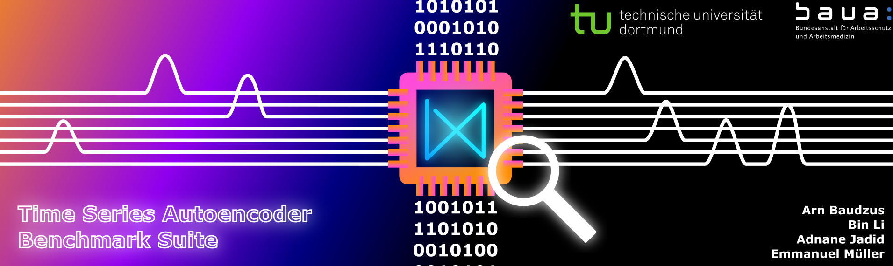
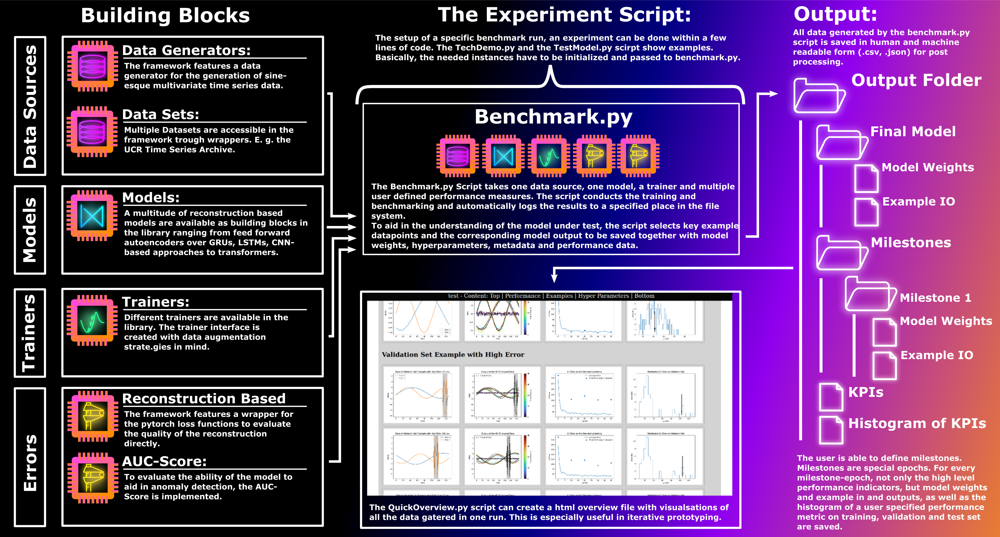

# Time Series Autoencoder Benchmark Suite

## About this Repo and Basic Overview

This repository houses a benchmark environment for reconstruction based multivariate time series anomaly detection algorithms, mainly autoencoders.
The intendet usecase for the repository is to be included as a submodule in other projects. In addition to the benchmark functionality the model provides, the 
object oriented interfaces defined here can also be used, to quickly build novel algorithms like e. g. ensemble methods. 
### Core Building Blocks:
The model is build around the following modular buildingblocks: 

* The Data - Time sereies data can either be provided in the form of a SetWrapper or a DataGenerator. Either of the two implements the same interface. 
They provide a method that outputs three datasets that can be used for training, validating and testing the anomaly detection algorithms. For more informations 
see the README.md files in the DataGenerators and the SetWrappers folder.
* The Model -  The Models in this framework all provide the same interface. They take a multivariate snipped of a timesereis as an input and output a reconstruction
of the same size and dimensionality. A list of the implemented models and an explaination how they function is given in the README.md file in the Models folder.
* The Training algorithm - The Training algorithm is the section of the program that coordinates the Training of the model. The Trainer interface incorporates a method for performing a single training epoch. It additionally houses methods that are automatically performed before and after the training process to e. g. implement data augmentation strategies in the library. Additional informaiton on trainers is provided in the Trainers folder.
* The Performance metrics - Performance metrics in this framework are twofold. There is the possibility to estimate the quality of a model as an anomaly detector by evaliating
its AUC-Score, which is only possible when the data source includes labels. In addition, the reconstruction error can be evaluated, using a wrapper for the diffrent metrics that are provided in pytorch. Additional information is provided in the Errors folder.
* Evaluation - There are some evaluation capabilities for the benchmark results build in the library. There is the possibility to create a report html including broad performance parameters of the model like e. g. the average reconstruction loss on the different datasets. Additionally the the evaluation method also selects exaple datasnippets where the model performed good, bad or average. 

A normal benchmark run can be automatically conducted without further coding, using the Benchmark.py script. If all the interfaces above are implmented as designed, the Benchmark.py takes the datasets, a model, a trainer and a selection of performance metrics and automatically trains and evaluates the model and logs the performance characteristics. The QuickOverview.py method can process this output afterwards to create a visualisation.

### Additional Building Blocks and Functionality:

Here are some auxilary building blocks, which are not required for the core functionality of the repository but rather provide functionality that can come in handy during experiments:

* Data Modifiers -  Data modifiers take the training, validation and test set and return a modified version of these datasets. The addNoise modifier e. g. adds uniform distributed noise of a specific amplitude to the datasets. More infomation is provided in the DataModifiers folder.
* Factorys -  The Factory classes are ment to provide easier access to the most used building blocks and configurations of the library. The DataSources factory e. g. incorporates a method for getting datasources by index, so that, in an experiment, the user can easilie iterate trough the data sources when testing the model.

### Hyperparameters in this Repo:

The modst basic required parameters for the building blocks are passed as arguments. The rest of the parameters is passed as a dictionary of hyperparameters.
The reasoning behind this is as follows: Dictionarys are sort of self documented (depends of the names of the keys of course.) and they can be easilie saved as .json. 
Using this functionality, the parameters passed to the building blocks are always saved along the other performance parameters when a benchmark run is conducted.
THis way, the results of the benchmark run function as additional documentation. 
To make the handling of the hyperparameters that are passed as dictionary easier for the user implementing the interfaces provided in this framework, the handling is described in teh parent class "block". Trainer and Model inherit directly form block. The data sources don't directly inherit a common class. The data sets however must be instances of datablock, a class, that defines how datasets should behave in this framework.

## Installing the Framework

At the moment, there is only an installation script for linux. Users of other operating systems can use it as a guidline to install the framework. We are working on providing installation scripts for every platform.  
The installation script sets up a virtual environment, containing all the classes necessairy to run the framework. In addition, it downloads and manages the data sets that have to be present for the set wrappers to function. 
Here is a list of things You need to prepare for a smooth installation:

* The shellscript downloads the UCR-Archive for You and manages it. How ever, the UCR-Archive is password protected. The password can be found on the UCR-Website (https://www.cs.ucr.edu/~eamonn/time\_series\_data\_2018/).
You will be promted to enter the password during the installation.
* The SWaT datasets are not publically available. To obtain them you need to apply at: https://docs.google.com/forms/d/e/1FAIpQLSdwOIR-LuFnSu5cIAzun5OQtWXcsOhmC7NtTbb-LBI1MyOcug/viewform.

## Working with the Framework

The experiment script takes the buildingblocks defined above and does an experiment. Individual experiments are stored in the experiments folder but are ment to be executed in the root of the repo.
In the Benchmark.py file are a bunch of methods to create the nessecairy dicts and save the hyperparameters and environment data.
Here a small example scipt, benchmarking a feed forward autoencoder on syntehtic sine data and visualizing the output:
<pre><code>
#!/bin/python

from Models.FeedForward import Model as FeedForwardAE
from DataGenerators.Sines import generateData as Sines
from Trainers.SingleInstanceTrainer import Trainer as OnlineTrainer

from Benchmark import benchmark,initializeDevice
from Evaluation.QuickOverview import plotOverview

pathToSave = "Tech Demo"

device = initializeDevice()
Dimensions = 2 # Dataset dimensions

trainingSet,validationSet,testSet = Sines(Dimensions)

model = FeedForwardAE(Dimensions,device)

trainer = OnlineTrainer(model,device)

resultFolder = benchmark(trainingSet,
          validationSet,
          testSet,
          model,
          trainer,
          n_epochs=40,
          pathToSave=pathToSave,
          device = device)

plotOverview(resultFolder)

</code></pre>

The scripts in the Evaluation dict are used to evaluate the data on the fs generated by the experiment. In evaluation is a subdirectory that is called Utility\_Plot which contains templates for often used plots and an directory called Utility\_Data which encapsulates some helpers for loading and saving data.

